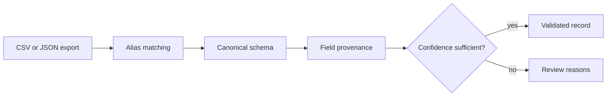

# SchemaShift

**Normalize inconsistent operational exports without hiding uncertainty.**

> All people, organizations, records, measurements, and outcomes in this
> repository are synthetic.

## The operational problem

Operational CSV and JSON exports rarely agree on names, types, or required fields.

## The proof

Alias-aware mapping, typed normalization, confidence, provenance, and a review queue.

## Why this is forward deployed

The project begins with the operator's decision, uncertainty, failure cost,
integration boundary, and handoff—not with a model demo. It makes policy and
evidence inspectable, preserves human authority for consequential cases, and
remains useful when the optional model layer is unavailable.

## Architecture



## Quickstart

```bash
python3.12 -m venv .venv
source .venv/bin/activate
python -m pip install -e '.[dev]'
pytest -q
schemashift
```

No API key or network connection is required.

## Evaluation and limitations

Run `pytest -q` for the reproducible evaluation. The fixture set is deliberately
synthetic and cannot establish production performance. A real deployment would
require operator observation, representative data, policy review, privacy review,
security testing, and a monitored rollout.

## Project documents

- [Field discovery and handoff](FIELD_NOTES.md)
- [Security boundaries](SECURITY.md)
- [Operating runbook](RUNBOOK.md)
- [Development provenance](DEVELOPMENT.md)
- [Release history](CHANGELOG.md)

## Topics

`data-quality`, `pydantic`, `etl`, `human-in-the-loop`, `python`
